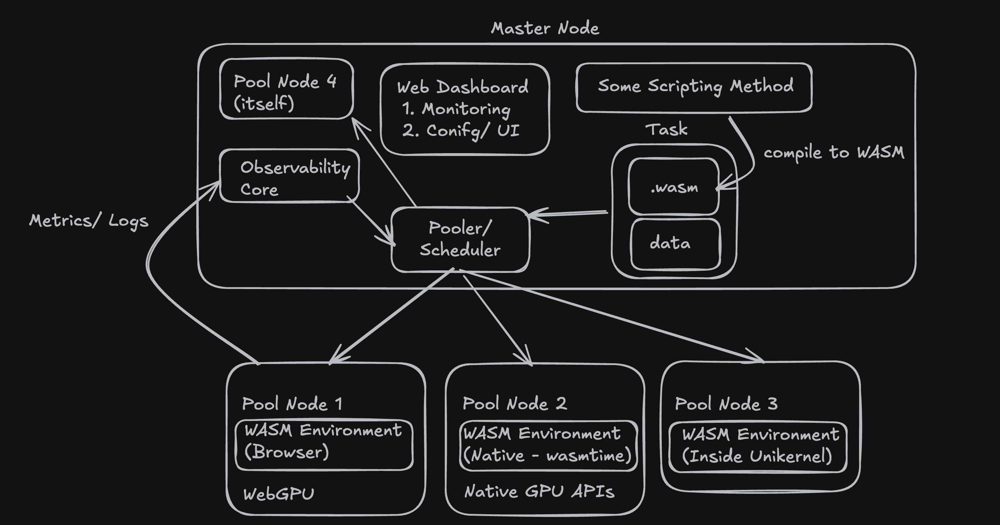

# WASM based Distributed Resource Pooling

We could pool GPU, CPU, Storage

Master Thesis - [https://edoc.sub.uni-hamburg.de/informatik/volltexte/2024/273/pdf/Anton\_Semjonov\_Opportunistic\_Distributed\_Computation\_Offloading\_using\_WebAssembly.pdf
](https://edoc.sub.uni-hamburg.de/informatik/volltexte/2024/273/pdf/Anton_Semjonov_Opportunistic_Distributed_Computation_Offloading_using_WebAssembly.pdf)They already show WASM based Pooling. There are 3 papers published by them. This could be our starting point.

WASM via Unikernel - https://blog.cloudkernels.net/posts/wasm-urunc/

Some of our points:
1\. Compute (CPU and GPU)
2\. Scheduling
3\. Security and Isolation
4\. Zero Client Setup (Atleast for non native workloads)
5\. Unikernel based Isolation 
6\. Storage Pooling
7\. Memory Pooling

We could provide different isolation levels by analyzing what are the security tradeoffs.

What wasimoff does not do:
1\. GPU based offloading/ pooling
2\. No resource aware scehduling mechanism
3\. Storage Pooling

